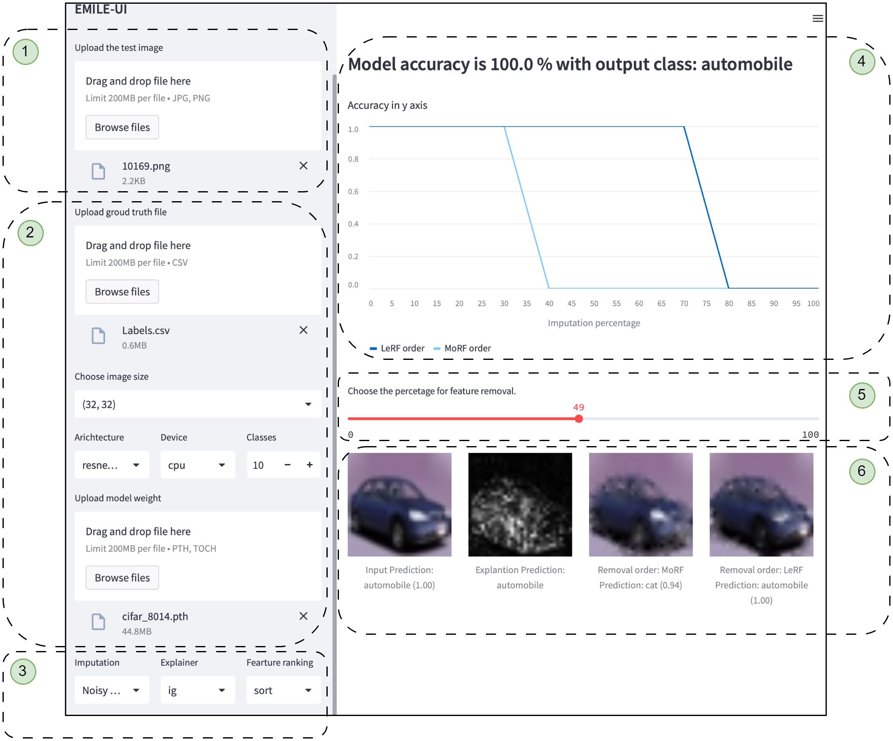

# EMILE-UI

Explaining MachIne Learning Explanations User Interface or EMILE-UI is a simple yet powerful tool for understanding an ML image classification model's behaviour in relation to its explanation.

- The primary goal of EMILE-UI is to allow an ML user to assess the accuracy of a generated saliency map. 
- We built EMILE-UI with a browser-based framework, [Streamlit](https://docs.streamlit.io), to ensure end users' hardware independence.
- Any Linux server with or without a GPU can be used to deploy EMILE-UI.
- For deep learning tasks, we used [PyTorch](https://pytorch.org), and our implementation can be extended with other deep learning frameworks.

### Steps

EMILE-UI operates in three steps.
The numbers in the brackets () correspond to the ones in the UI screenshot. 
- Download the a test image, label file (csv) and weight of resnet18 architecture from `downloads` directory above and follow the steps
 1. Step One
	 - The user selects the deep learning architecture & uploads the weights (2).
	 - The user then selects the explanation method and configures its hyperparameters (3). 
 2. Step Two
	 - The user uploads the test image and the ground truth (1).
 3. Step Three
	 - The model generates perturbation curves (4), and the saliency map (6) for the input image.  
	 - The user selects the amount of feature removal from the input image using the percentage slider (5), and the resultant images are shown at The bottom-right (6).